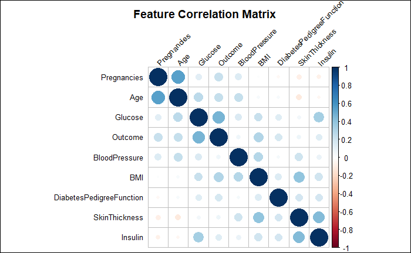

# Introduction
Diabetes is a chronic (long-lasting) disease that affects how our body turns food into energy. According to the _**[CDC](https://www.cdc.gov/diabetes/basics/index.html)**_, More than 37 million US adults have diabetes, and 1 in 5 do not know they have diabetes. In the last 20 years, the number of adults diagnosed with diabetes has more than doubled. Diabetes is the seventh leading cause of death in the United States. Diabetes is the No. 1 cause of kidney failure, lower-limb amputations, and adult blindness.
This project aims at developing a machine-learning model that accurately predicts if a person has diabetes or not.

## Diabetes Dataset
The diabetes dataset used in this project is from _**[Kaggle](https://www.kaggle.com/datasets/akshaydattatraykhare/diabetes-dataset)**_, containing nine attributes for 768 entries. All patients in the dataset are females of Pima Indian heritage at least 21 years old.

### Predictor Variables:

- Pregnancies: Number of pregnancies
- Glucose: Glucose level in blood
- Blood Pressure: Blood pressure measurement
- SkinThickness: Thickness of the skin
- Insulin: Insulin level in the blood
- BMI: Body mass index
- DiabetesPedigreeFunction: Diabetes percentage
- Age: Age

### Target Variable:

- Outcome: 
  - 1: The patient has diabetes
  - 0: The patient does not have diabetes

## Process and Workflow
The main steps in the project involve the following:

- Data Extraction: Download the dataset from [Kaggle](https://www.kaggle.com/datasets/akshaydattatraykhare/diabetes-dataset/download?datasetVersionNumber=1), upload the dataset to [Github](https://raw.githubusercontent.com/ushaakumaar/diabetes_prediction/main/dataset/diabetes.csv), import the dataset from GitHub, and prepare the data
- Exploring the dataset's structure.
- Performing Exploratory Data Analysis (EDA).
- Developing a machine-learning classification model for classifying the patients as diabetic or non-diabetic.

# Methods/Analysis
## Data Exploration and Transformation
Let us begin by splitting the dataset into training and testing datasets and then start exploring the structure of the dataset.

### Split dataset to train and test datasets
We split the Diabetes dataset into a training dataset called train_set and an evaluation dataset called test_set. The train and test set will have 90% and 10% of Diabetes data, respectively.

### Structure of dataset
Diabetes dataset has 768 observations, 8 predictor variables and 1 target variable. All variables are numeric.
```
Classes ‘data.table’ and 'data.frame':	768 obs. of  9 variables:
 $ Pregnancies             : int  6 1 8 1 0 5 3 10 2 8 ...
 $ Glucose                 : int  148 85 183 89 137 116 78 115 197 125 ...
 $ BloodPressure           : int  72 66 64 66 40 74 50 0 70 96 ...
 $ SkinThickness           : int  35 29 0 23 35 0 32 0 45 0 ...
 $ Insulin                 : int  0 0 0 94 168 0 88 0 543 0 ...
 $ BMI                     : num  33.6 26.6 23.3 28.1 43.1 25.6 31 35.3 30.5 0 ...
 $ DiabetesPedigreeFunction: num  0.627 0.351 0.672 0.167 2.288 ...
 $ Age                     : int  50 31 32 21 33 30 26 29 53 54 ...
 $ Outcome                 : int  1 0 1 0 1 0 1 0 1 1 ...
 - attr(*, ".internal.selfref")=<externalptr> 
 ```
 
### Summary Statistics of dataset
The below statistics show that the minimum value for Glucose, blood pressure, skin thickness, Insulin, and BMI is 0. It is ideally impossible for a person to have 0 glucose level or blood pressure or skin thickness or insulin level, or BMI. It appears to be a data error or missing data. 

```
  Pregnancies        Glucose      BloodPressure    SkinThickness      Insulin           BMI       
 Min.   : 0.000   Min.   :  0.0   Min.   :  0.00   Min.   : 0.00   Min.   :  0.0   Min.   : 0.00  
 1st Qu.: 1.000   1st Qu.: 99.0   1st Qu.: 62.00   1st Qu.: 0.00   1st Qu.:  0.0   1st Qu.:27.30  
 Median : 3.000   Median :117.0   Median : 72.00   Median :23.00   Median : 30.5   Median :32.00  
 Mean   : 3.845   Mean   :120.9   Mean   : 69.11   Mean   :20.54   Mean   : 79.8   Mean   :31.99  
 3rd Qu.: 6.000   3rd Qu.:140.2   3rd Qu.: 80.00   3rd Qu.:32.00   3rd Qu.:127.2   3rd Qu.:36.60  
 Max.   :17.000   Max.   :199.0   Max.   :122.00   Max.   :99.00   Max.   :846.0   Max.   :67.10  
 DiabetesPedigreeFunction      Age           Outcome     
 Min.   :0.0780           Min.   :21.00   Min.   :0.000  
 1st Qu.:0.2437           1st Qu.:24.00   1st Qu.:0.000  
 Median :0.3725           Median :29.00   Median :0.000  
 Mean   :0.4719           Mean   :33.24   Mean   :0.349  
 3rd Qu.:0.6262           3rd Qu.:41.00   3rd Qu.:1.000  
 Max.   :2.4200           Max.   :81.00   Max.   :1.000 
```
Now, let us check what percentage of each variable contains missing data. It is evident from the below table that Glucose, blood pressure, and BMI have less than 5% of data missing, while 30% of SkinThickness and almost 50% of Insulin data are incorrect or missing.
```
Percentage(%) of Variable having Missing data
=============================================================================
Variable                                                        Percentage(%)
-----------------------------------------------------------------------------
Glucose - Missing Percentage	                                         0.6510
BloodPressure - Missing Percentage	                                   4.5573
SkinThickness - Missing Percentage	                                  29.5573
Insulin - Missing Percentage	                                        48.6979
BMI - Missing Percentage	                                             1.4323
=============================================================================
```

### Median Imputation
In statistics, Median imputation is the process of replacing all occurrences of missing values within a variable ("0" in our case) with the median. We can perform Median imputation when data are missing completely at random and when no more than 5% of the variable contains missing data. So, let us perform median imputation by replacing 0s with median values for Glucose, blood pressure, and BMI. The median value should be calculated only in the training set and used to replace missing data in both training and test sets to avoid over-fitting.

### Feature Correlation Matrix
We could observe from the below correlation matrix that Glucose, Age, Pregnancies, and BMI have the most direct correlation with Outcome. In contrast, Insulin, SkinThickness, and Blood Pressure have the most negligible direct correlation with Outcome. SkinThickness and Insulin have an inverse correlation with Age and Pregnancies.



### Class Distribution
Out of 768 entries, there are 500 with Outcome '0' and 268 with Outcome '1'. Class Imbalance is not defined formally, but a ratio of 1 to 10 is usually considered imbalanced enough to benefit from balancing techniques.


# Machine Learning Models
We noticed during data exploration that SkinThickness and Insulin have approximately 30% and 50% of data missing, respectively. The correlation Matrix also revealed that these variables have the most negligible direct correlation, So we will not use SkinThickness and Insulin in our Models.

## Multi Linear Regression Model
We could see from the summary that the P-values of Glucose, BMI and Pregnancies are the least so they are the top three most relevant features. 

```
Call:
lm(formula = Outcome ~ . - SkinThickness - Insulin, data = train_set)

Residuals:
     Min       1Q   Median       3Q      Max 
-1.13551 -0.28343 -0.07239  0.28359  0.99709 

Coefficients:
                           Estimate Std. Error t value Pr(>|t|)    
(Intercept)              -1.0235220  0.1076751  -9.506  < 2e-16 ***
Pregnancies               0.0223077  0.0053168   4.196 3.08e-05 ***
Glucose                   0.0065300  0.0005314  12.287  < 2e-16 ***
BloodPressure            -0.0009046  0.0013588  -0.666  0.50580    
BMI                       0.0133056  0.0023770   5.598 3.15e-08 ***
DiabetesPedigreeFunction  0.1276376  0.0462052   2.762  0.00589 ** 
Age                       0.0019720  0.0015994   1.233  0.21801    
---
Signif. codes:  0 ‘***’ 0.001 ‘**’ 0.01 ‘*’ 0.05 ‘.’ 0.1 ‘ ’ 1

Residual standard error: 0.3916 on 684 degrees of freedom
Multiple R-squared:  0.3317,	Adjusted R-squared:  0.3259 
F-statistic: 56.59 on 6 and 684 DF,  p-value: < 2.2e-16
```
### Cross Validation
Let us test the model against test dataset and check the model accuracy.

Confusion Matrix:
```
mlr_prediction  0  1
             0 42 11
             1  8 16
```

```
MODEL PERFORMANCE RESULTS:
=============================================================================
Model                                                                Accuracy
-----------------------------------------------------------------------------
Model 1: Multi Linear Regression Model	                               0.7532
=============================================================================
	
```

## Logistic Regression Model
Let us try the Logistic regression model on our dataset. Since our Outcome is binary (zeroes and ones), we will use binomial distribution. We could see from the summary again that the P-values of Glucose, BMI, and Pregnancy are the least, so they are the top three most relevant features.
```
Call:
glm(formula = Outcome ~ . - SkinThickness - Insulin, family = "binomial", 
    data = train_set)

Deviance Residuals: 
    Min       1Q   Median       3Q      Max  
-2.8381  -0.7048  -0.3874   0.6786   2.4280  

Coefficients:
                          Estimate Std. Error z value Pr(>|z|)    
(Intercept)              -9.220252   0.861187 -10.706  < 2e-16 ***
Pregnancies               0.137227   0.034669   3.958 7.55e-05 ***
Glucose                   0.037927   0.003892   9.745  < 2e-16 ***
BloodPressure            -0.007415   0.009072  -0.817  0.41375    
BMI                       0.089865   0.016606   5.412 6.25e-08 ***
DiabetesPedigreeFunction  0.877586   0.315309   2.783  0.00538 ** 
Age                       0.012459   0.010011   1.245  0.21331    
---
Signif. codes:  0 ‘***’ 0.001 ‘**’ 0.01 ‘*’ 0.05 ‘.’ 0.1 ‘ ’ 1

(Dispersion parameter for binomial family taken to be 1)

    Null deviance: 893.71  on 690  degrees of freedom
Residual deviance: 631.97  on 684  degrees of freedom
AIC: 645.97

Number of Fisher Scoring iterations: 5
```
### Cross Validation
Let us test the model against test dataset and check the model accuracy.

Confusion Matrix:
```
logistic_reg_prediction  0  1
                      0 42 11
                      1  8 16
```

```
MODEL PERFORMANCE RESULTS:
=============================================================================
Model                                                                Accuracy
-----------------------------------------------------------------------------
Model 1: Multi Linear Regression Model	                               0.7532
Model 2: Logistic Regression                                           0.7532
=============================================================================
	
```

## Decision Tree
Let us try Decision Tree model on our dataset.


### Cross validation
Let us test the model against test dataset and check the model accuracy. Decision tree model did not yield better accuracy than Linear regression and Logistic regression models.

Confusion Matrix:
```
decision_tree_prediction  0  1
                       0 41 15
                       1  9 12
```

```
MODEL PERFORMANCE RESULTS:
=============================================================================
Model                                                                Accuracy
-----------------------------------------------------------------------------
Model 1: Multi Linear Regression Model	                               0.7532
Model 2: Logistic Regression                                           0.7532
Model 3: Decision Tree                                                 0.6883
=============================================================================
	
```
## XGBoost
Extreme Gradient Boosting (XGBoost) is one of the Boosting technique in machine learning that has been shown to produce models with high predictive accuracy. From the output we could see that the minimum test-RMSE is achieved at 24 rounds. Beyond this point, the test-RMSE begins to increase, which is a sign that we are overfitting the training data. So, we will define our final XGBoost model to use 24 rounds.

### Cross validation
Let us test the model against test dataset and check the model accuracy.


```
MODEL PERFORMANCE RESULTS:
=============================================================================
Model                                                                Accuracy
-----------------------------------------------------------------------------
Model 1: Multi Linear Regression Model	                               0.7532
Model 2: Logistic Regression                                           0.7532
Model 3: Decision Tree                                                 0.6883
Model 4: XGBoost	                                                     0.7143
=============================================================================
	
```

# Results
Accuracy of Linear Regression and Logistic Regression models are the highest among the four machine learning models we tried our dataset on.
```
MODEL PERFORMANCE RESULTS:
=============================================================================
Model                                                                Accuracy
-----------------------------------------------------------------------------
Model 1: Multi Linear Regression Model	                               0.7532
Model 2: Logistic Regression                                           0.7532
Model 3: Decision Tree                                                 0.6883
Model 4: XGBoost	                                                     0.7143
=============================================================================
	
```

# Conclusion
We started with the Multi Linear Regression model and tried three other models Logistic Regression, Decision Tree, and XGBoost. The Multi Linear Regression and Logistic Regression models performed better than the Decision Tree and XGBoost. The accuracy of Multi Linear Regression and Logistic model was `r mlr_accuracy*100`% followed by XGBoost with `r xgboost_accuracy*100`% accuracy and the decision tree with the least accuracy of `r decision_tree_accuracy*100`%.

## Limitations
Insulin and SkinThickness variables were missing data. Our models could have predicted the Outcome more accurately if we had data on these variables. The algorithms' precision increases when the dataset's size is large. Hence, more data will make the model more accurate in predicting if a person has diabetes. 

## Future Work
As with any such project, there is always room for improvement. As part of this project, we trained and evaluated only four predictive models on the dataset. We could train more predictive models and improve their performance with hyperparameter tuning. Also, the models' performance increases when the size of the dataset increases. So having more data will make the model more accurate in predicting if a person has diabetes.

## Acknowledgments
I want to thank the instructor, Rafael A. Irizarry of HarvardX's Professional Certificate in Data Science, for the detailed and clear explanation in his lectures throughout the series. I also want to thank and appreciate the staff and peers for providing their support, help, and guidance in the discussion forums.

## References
- [Diabetes Basics | CDC](https://www.cdc.gov/diabetes/basics/index.html)
- [Diabetes Dataset | Kaggle](https://www.kaggle.com/datasets/akshaydattatraykhare/diabetes-dataset)
- [Median Imputaion](https://medium.com/analytics-vidhya/feature-engineering-part-1-mean-median-imputation-761043b95379)
- [Decision Tree](https://www.tutorialspoint.com/r/r_decision_tree.htm)
- [Binary Classification Models](https://towardsdatascience.com/top-10-binary-classification-algorithms-a-beginners-guide-feeacbd7a3e2)
